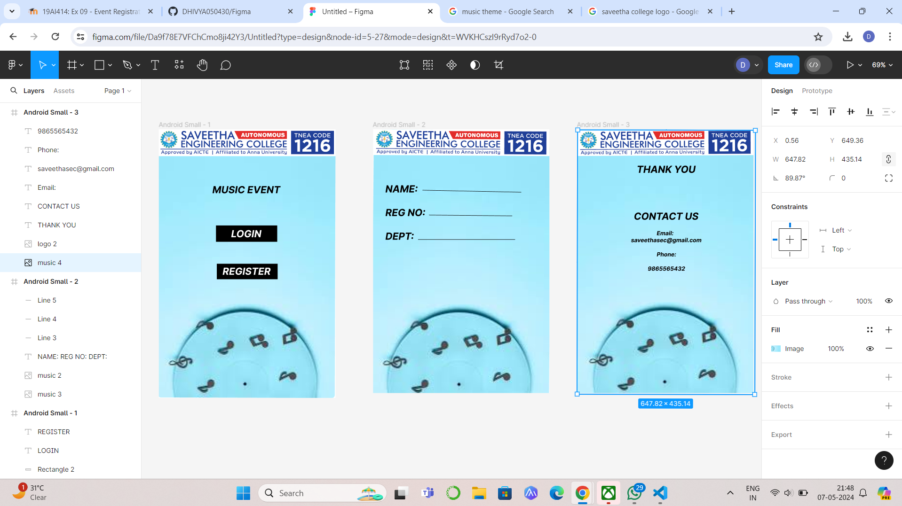

# Ex09 Event Registration Web Application
## Date:07.04.2024

## AIM:
To design, develop and deploy a web application for event registration.

## DESIGN STEPS:

### Step 1:
Create a new frame.

### Step 2:
Select any one preset size of your choice.

### Step 3:
Select the shapes you need.

### Step 4:
Import images as needed.

### Step 5:
Create pages based on your need and link them.

### Step 6:

Validate the HTML and CSS code.

### Step 6:

Publish the website in the given URL.

## DESIGN TOOL:
Figma

## CODE:
```
Home Page

<div className="AndroidSmall1" style={{width: 433, height: 659, position: 'relative', background: 'white'}}>
  
  
  <div className="MusicEvent" style={{left: 131, top: 134, position: 'absolute', color: 'black', fontSize: 24, fontFamily: 'Inter', fontStyle: 'italic', fontWeight: '700', wordWrap: 'break-word'}}>MUSIC EVENT</div>
  <div className="Rectangle1" style={{width: 150, height: 40, left: 140, top: 236, position: 'absolute', background: 'black'}} />
  <div className="Rectangle2" style={{width: 149, height: 38, left: 142, top: 330, position: 'absolute', background: 'black'}} />
  <div className="Login" style={{left: 177, top: 242, position: 'absolute', color: 'white', fontSize: 24, fontFamily: 'Inter', fontStyle: 'italic', fontWeight: '700', wordWrap: 'break-word'}}>LOGIN</div>
  <div className="Register" style={{left: 156, top: 334, position: 'absolute', color: 'white', fontSize: 24, fontFamily: 'Inter', fontStyle: 'italic', fontWeight: '700', wordWrap: 'break-word'}}>REGISTER</div>
</div>

Page 2

<div className="AndroidSmall2" style={{width: 432, height: 647, position: 'relative', background: 'white'}}>
  
  
  <div className="NameRegNoDept" style={{left: 30, top: 132, position: 'absolute', color: 'black', fontSize: 24, fontFamily: 'Inter', fontStyle: 'italic', fontWeight: '700', wordWrap: 'break-word'}}>NAME:<br/><br/>REG NO:<br/><br/>DEPT:</div>
  <div className="Line3" style={{width: 204.01, height: 0, left: 137, top: 211, position: 'absolute', transform: 'rotate(0.57deg)', transformOrigin: '0 0', border: '1px black solid'}}></div>
  <div className="Line4" style={{width: 238, height: 0, left: 110, top: 271, position: 'absolute', border: '1px black solid'}}></div>
  <div className="Line5" style={{width: 242.05, height: 0, left: 121, top: 150, position: 'absolute', transform: 'rotate(1.18deg)', transformOrigin: '0 0', border: '1px black solid'}}></div>
</div>

Page 3


```

## OUTPUT:


## RESULT:
The program to design, develop and deploy a web application for event registration is completed successfully.
